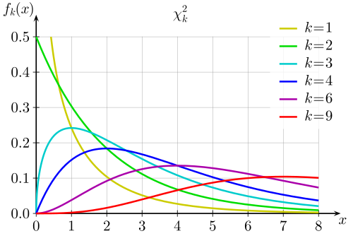
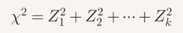
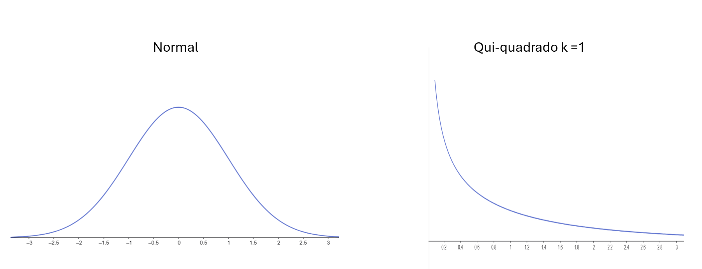
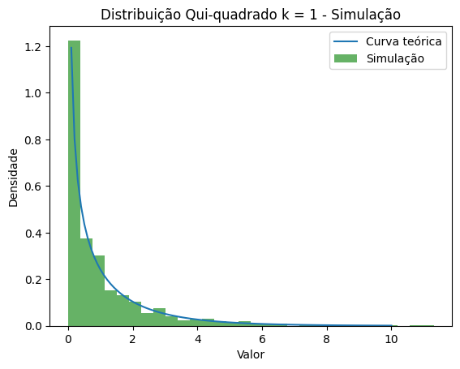
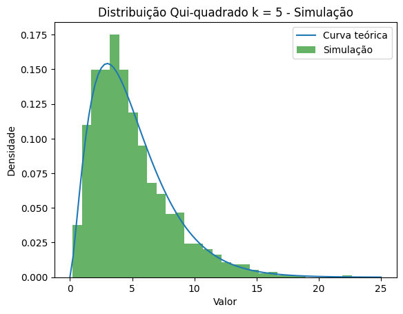
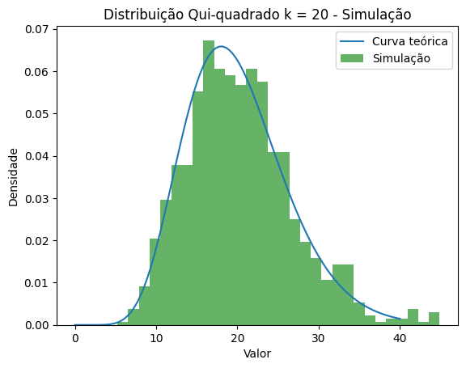

# Simulacao_qui_quadrado
Simulação da distribuição Qui-quadrado

O Qui-quadrado é uma distribuição estatística, e o nome sempre me foi curioso. Lembra o Quico do seriado Chaves, dizendo seu característico “Quico, Quico, há há há”!

Bom, o Qui-quadrado, como o próprio nome indica, deve ter alguma relação com algo ao quadrado. Sim, e na realidade é soma da famosa variável aleatória Normal ao quadrado.

Vamos fazer algumas simulações, para tangibilizar o conhecimento. Fiz as visualizações abaixo no Geogebra, e recomendo muito a sua utilização. E os código de simulação em Python.

A distribuição Qui-quadrado com k graus de liberdade é definida como:

Onde cada Z_i é uma variável aleatória com distribuição Normal padrão e todas são independentes.

O nome “graus de liberdade” não é muito bom, porque na verdade é um parâmetro da distribuição (o número de Normais que somo), e não algo que eu possa “mexer”.

Vamos começar com uma Normal apenas. A Normal padronizada significa que tem média zero e desvio padrão 1. Se eu elevar a Normal ao quadrado, a parte negativa vira positiva, e fica assimétrica, porque rebato a parte negativa para a positiva.

Quando elevo ao quadrado, os valores próximos a zero continuam próximos a zero, os valores grande se tornam maiores ainda. A média da Normal ao quadrado é igual a 1 (há uma demonstração até simples, é só pesquisar). E a Normal ao quadrado é a Qui-quadrado com 1 grau de liberdade.

E se eu somar mais duas Normais? Terei uma Qui-quadrado com 2 graus de liberdade.

Dá para fazer um programinha para simular a soma de Normais.

O código np.random.normal(loc=0, scale=1, size=k) sorteia k números aleatórios segundo uma distribuição Normal. O resto do código é para amostrar isso N vezes.

k = 1
N = 1000 #Numero de amostras
chi_squared_stat =[]
for _ in range(N):
  x = np.random.normal(loc=0, scale=1, size=k)
  x_squared = x**2 
  chi_squared_stat.append(np.sum(x_squared))

Para 5 graus de liberdade, simulado via código e distribuição teórica.

Note que a média da curva agora será igual a 5, porque a média de uma qui-quadrado de grau de liberdade 1 é igual a 1 – e esta é somada 5 vezes.

Para k graus de liberdade onde k é grande, a curva tende a uma Normal com média k (por conta da Lei dos Grandes Números).

Deixei o código da simulação no Github.
[https://github.com/asgunzi/Simulacao_qui_quadrado/blob/main/qui_quadrado.ipynb](https://github.com/asgunzi/Simulacao_qui_quadrado/blob/main/qui_quadrado.ipynb)
